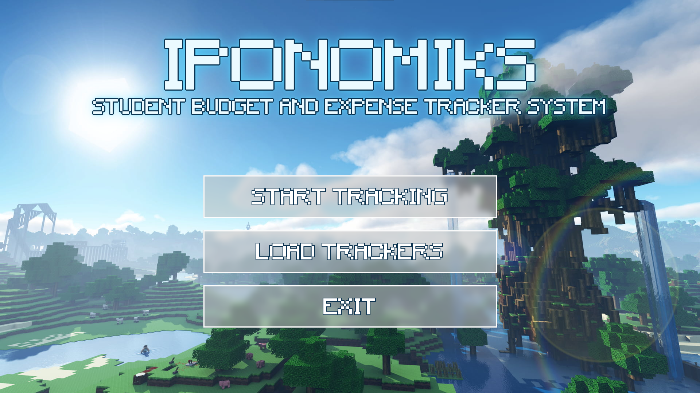
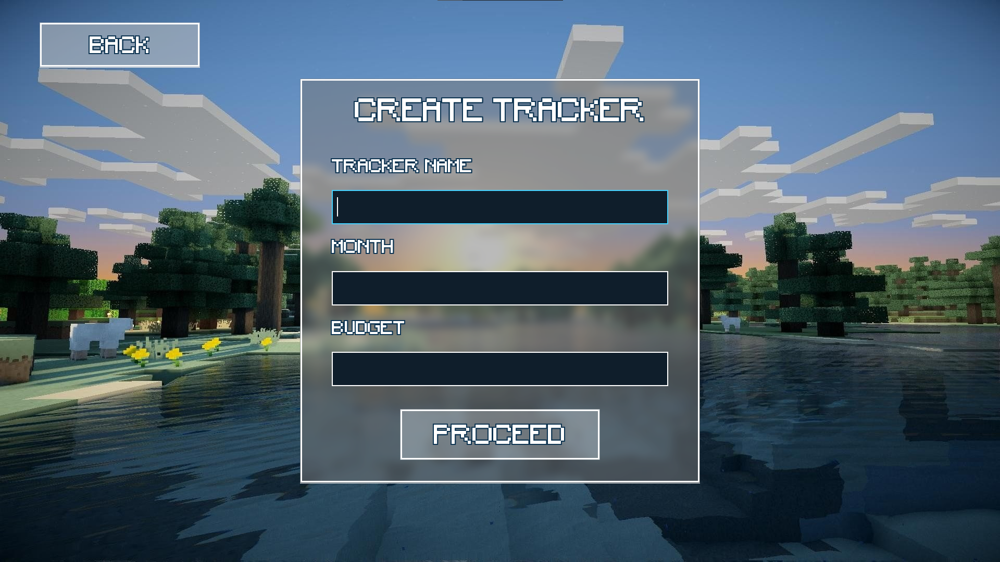
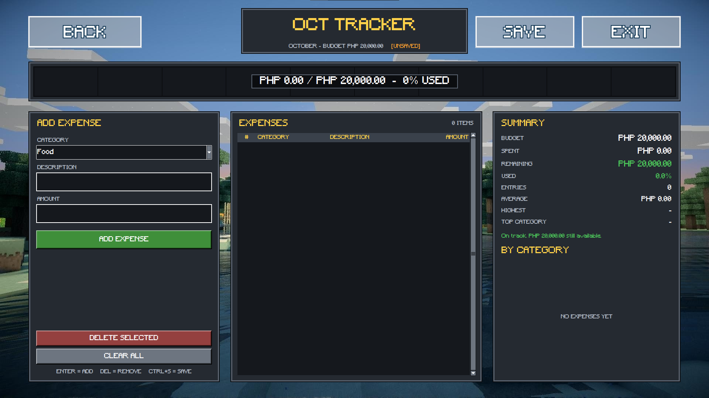
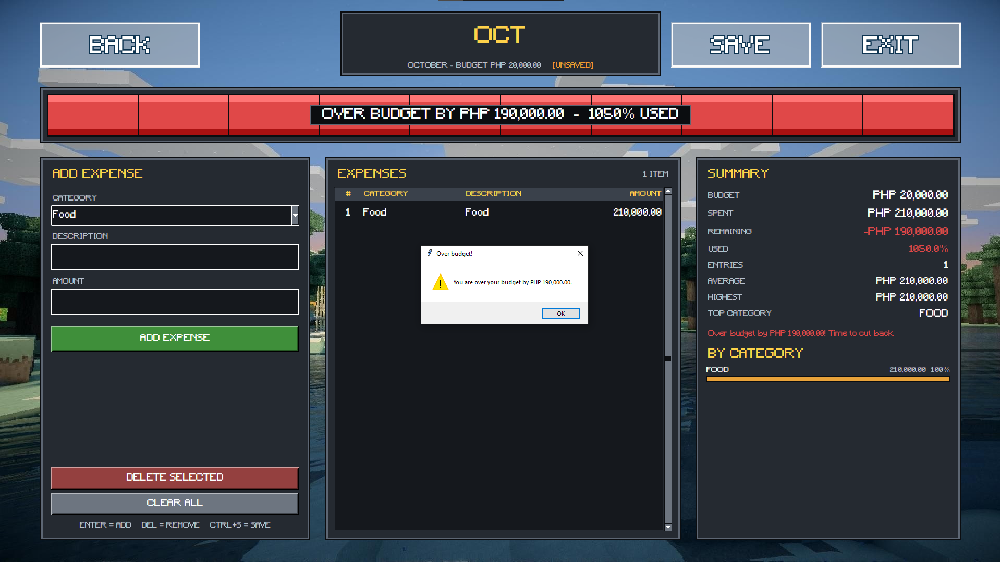
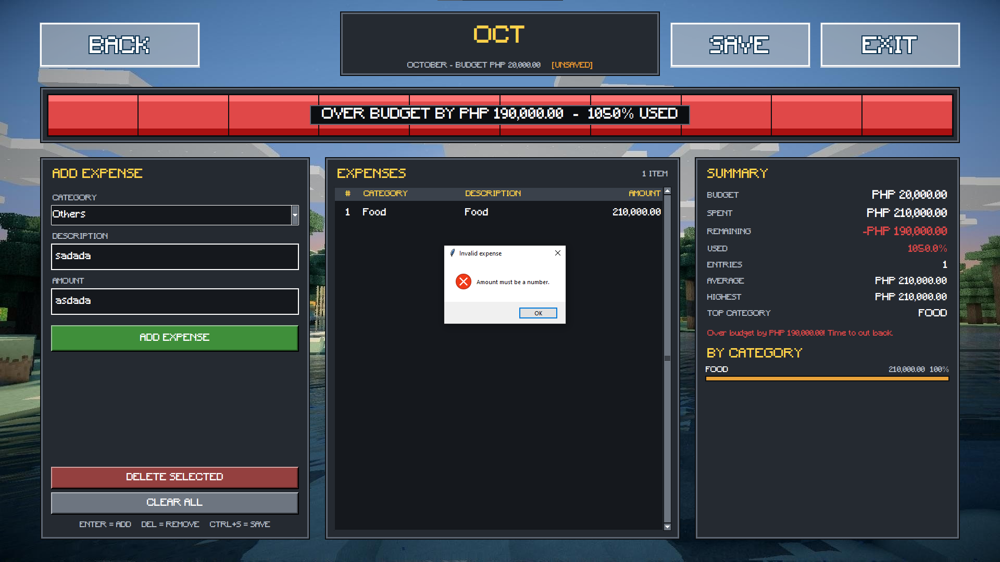
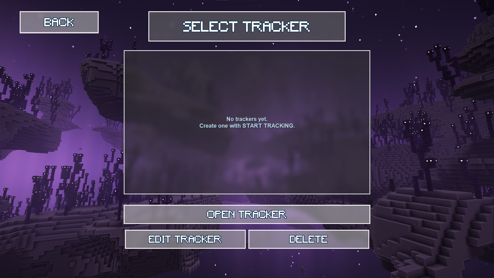
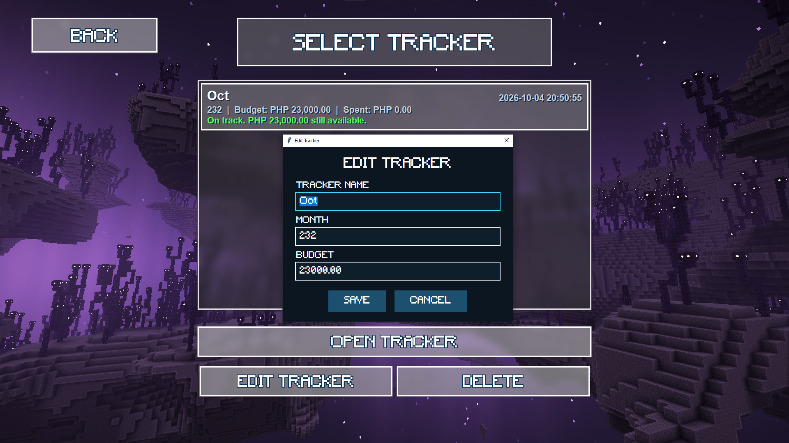

# 1. Project Title

**IPONOMIKS: Budget and Expense Tracker System**

---

# 2. Project Description

IPONOMIKS is a desktop application that helps students plan a monthly budget and record their expenses. The user creates a tracker (a name, a month, and a budget), adds expenses under categories, and the system shows how much has been spent, how much is left, and whether the student is still on track. Trackers can be saved, reopened, edited, and deleted.

**Problem addressed:** Students usually live on a fixed allowance and lose track of small daily spending such as food, fare, and mobile load. Many run out of money before the month ends because they have no simple way to see where it went. IPONOMIKS gives them a simple, offline tool that shows their spending clearly and warns them before they go over budget.

---

# 3. Project Objectives

- Let anyone set a monthly budget and record expenses by category.
- Show the remaining budget and a clear status (safe, warning, or over budget) with a color-coded progress bar.
- Summarize spending by category so students can see where their money goes.
- Save trackers in a database so they can be reopened, edited, or deleted later.
- Validate all input so invalid data is never stored.
- Apply object-oriented programming and a layered structure (UI, logic, database).

---

# 4. Features

| Feature | Description |
|---|---|
| Main menu | Entry screen with **Start Tracking**, **Load Trackers**, and **Exit**, with an animated glowing title. |
| Create tracker | Enter a tracker name, month, and budget. Missing or invalid values are rejected with a message. |
| Add expense | Choose a category, type an optional description, and enter an amount. The list, totals, and status update immediately. |
| Delete expenses | Remove the selected expense(s) (multi-select supported), or **Clear All** after a confirmation. |
| Budget progress bar | A bar across the top shows the amount spent against the budget, colored green, orange, or red by status. |
| Budget status | **Safe** below 75% of the budget, **Warning** from 75%, **Over budget** above 100%, each with a message. A pop-up warns the moment spending goes over the budget. |
| Summary panel | Budget, spent, remaining, percent used, number of entries, average expense, highest expense, top category, and a bar for each category with its share of spending. |
| Save | Saves the tracker and its expenses to the database (**SAVE** button or **Ctrl+S**). The dashboard shows `[SAVED]` or `[UNSAVED]`. |
| Unsaved changes prompt | Leaving the dashboard with unsaved changes asks whether to save first. |
| Load trackers | Lists all saved trackers with their month, budget, amount spent, status message, and date created. |
| Open tracker | Reopens a saved tracker with all of its expenses (button, double-click, or Enter). |
| Edit tracker | Changes a saved tracker's name, month, or budget. Warns if the new budget is lower than what was already spent. |
| Delete tracker | Deletes a saved tracker and its expenses after a confirmation. |
| Keyboard shortcuts | Enter = add expense, Delete = remove selected, Ctrl+S = save, Up/Down/Enter/Delete/Esc on the load screen. |
| Input validation | Amounts must be positive numbers (max 10,000,000), categories must come from the list, and descriptions are limited to 40 characters. |
| Expense categories | Food, Transportation, School Supplies, Tuition & Fees, Boarding / Rent, Load & Internet, Utilities, Health, Entertainment, Shopping, Savings, Others. |

---

# 5. Technologies Used

- **Programming language:** Python 3.13
- **GUI framework:** Tkinter (included with Python), including `ttk` widgets (`Treeview`, `Combobox`, `Scrollbar`)
- **Database:** SQLite (`sqlite3` module, included with Python)
- **Other libraries and tools:**
  - [Pillow](https://pypi.org/project/pillow/) for image handling (backgrounds, blur, glass effects, glowing text)
  - `json`, `dataclasses`, `pathlib`, `contextlib`, `tempfile`, and `os` from the Python standard library
  - Git and GitHub for version control

---

# 6. Project Structure

```
iponomiks/
├── main.py                 # Entry point; App class connects all screens
├── records.py              # Reads and writes database/records.json
├── backgrounds/            # Image assets for the screens
│   ├── mainmenubg.jpg
│   ├── trackerbg.jpg
│   └── loadbg.png
├── database/
│   ├── __init__.py         # Exposes the database functions
│   ├── database.py         # All SQLite code (tables and queries)
│   ├── iponomiks.db        # SQLite database file
│   └── records.json        # JSON summary records of saved trackers
├── logic/
│   ├── budget.py           # Budget rules, status, and money formatting
│   ├── expenses.py         # Expense categories, ExpenseItem, ExpenseLog
│   ├── summary.py          # Builds the spending summary
│   └── validation.py       # Input validation and ValidationError
└── ui/
    ├── mainmenu.py         # Main menu, glass buttons, glowing title, background
    ├── start.py            # Create Tracker window
    ├── dashboard.py        # Dashboard: expense form, list, summary, progress bar
    ├── load.py             # Saved trackers list, edit dialog, delete
    └── widgets.py          # Reusable widgets (GlassPanel, FontLoader)
```

**Purpose of each folder:**

- `ui/` holds everything the user sees and interacts with. It contains no business rules.
- `logic/` holds the rules of the system (validation, budget status, summary). It contains no GUI code.
- `database/` holds all SQL and the stored data. No other file writes SQL.
- `backgrounds/` holds the images used by the screens.
- `main.py` starts the app and decides which window opens next.

---

# 7. Installation and Setup

**Requirements:** Windows (the font handling is Windows-oriented), Python 3.10 or newer, and Git.

1. Clone the repository:
   ```bash
   git clone https://github.com/usercalledred/iponomiks.git
   cd iponomiks
   ```
2. (Optional) Create a virtual environment:
   ```bash
   python -m venv venv
   venv\Scripts\activate
   ```
3. Install the dependency:
   ```bash
   pip install pillow
   ```
4. (Optional) For the custom look, place `MINECRAFT.TTF` in a folder named `fonts/` in the project root. If it isn't found, the app prints a warning and falls back to Arial.
5. Run the application from the project root:
   ```bash
   python main.py
   ```

The database file and tables are created automatically on the first run.

**Dependencies:** Pillow (`pip install pillow`). Tkinter and SQLite come with Python.

---

# 8. How to Use the System

1. Launch the app with `python main.py`. It opens in fullscreen mode.
2. Click **START TRACKING**.
3. Enter the **tracker name**, **month**, and **budget**, then click **PROCEED** (or press Enter).
4. On the dashboard, choose a **category**, type a **description** (optional), type the **amount**, and click **ADD EXPENSE** (or press Enter).
5. Watch the progress bar, the expense list, and the summary update. The status turns orange at 75% of the budget and red when over budget.
6. To remove expenses, select one or more rows and click **DELETE SELECTED** (or press Delete). **CLEAR ALL** removes everything after a confirmation.
7. Click **SAVE** (or press Ctrl+S) to store the tracker. The label changes from `[UNSAVED]` to `[SAVED]`.
8. Click **BACK** to return. If there are unsaved changes, the app asks whether to save first. **EXIT** closes the whole application.
9. From the main menu, click **LOAD TRACKERS** to see the saved trackers.
10. Select a tracker, then:
    - **OPEN TRACKER** (or double-click, or Enter) to open it on the dashboard,
    - **EDIT TRACKER** to change its name, month, or budget,
    - **DELETE** to remove it and its expenses (after a confirmation).

---

# 9. OOP Implementation

## Important classes and objects

| Class | File | Role |
|---|---|---|
| `App` | `main.py` | Creates the root window and connects the screens |
| `MainMenu` | `ui/mainmenu.py` | Main menu screen with animated glowing title |
| `GlassButton` | `ui/mainmenu.py` | Reusable glass-style button |
| `GlowTextRenderer` | `ui/mainmenu.py` | Draws outlined and glowing text, caches fonts |
| `ImageBackground` | `ui/mainmenu.py` | Loads and scales a background image |
| `TrackerWindow` | `ui/start.py` | Create Tracker window |
| `TrackerDashboard` | `ui/dashboard.py` | Dashboard window (form, list, summary, bar) |
| `MinecraftButton` | `ui/dashboard.py` | Styled button used on the dashboard |
| `Theme` | `ui/dashboard.py` | Holds the color constants and status colors |
| `LoadTrackerWindow` | `ui/load.py` | Saved trackers window |
| `TrackerList` | `ui/load.py` | Custom scrollable, selectable list of trackers |
| `EditTrackerDialog` | `ui/load.py` | Dialog for editing a saved tracker |
| `GlassPanel`, `FontLoader` | `ui/widgets.py` | Reusable panel and font loader |
| `Budget`, `BudgetStatus` | `logic/budget.py` | Budget rules and status values |
| `ExpenseItem`, `ExpenseLog` | `logic/expenses.py` | One expense, and the list of expenses of a tracker |
| `Summary` | `logic/summary.py` | Result object returned by `build_summary` |
| `ValidationError` | `logic/validation.py` | Custom exception for invalid input |

## Where the OOP concepts are applied

- **Encapsulation:**
  - `ExpenseLog` keeps its list in the internal `_items` attribute. Other code changes it only through `add()`, `remove()`, and `clear()`, and reads it through the `items` property, which returns a copy. Validation happens inside `add()`.
  - `TrackerList` keeps `_trackers`, `_order`, `_selected_id`, and `_offset` internal, and exposes a read-only `selected` property plus `select()`, `move_selection()`, and `set_trackers()`.
  - `Budget` keeps the budget total and the rules (remaining, percent used, status, message) together in one object.
  - `ExpenseItem` is a frozen dataclass, so its values cannot be changed after creation.
  - `database.py` hides its helpers (`_session()`, `_insert_expenses()`) behind public functions.
- **Inheritance:**
  - `TrackerWindow`, `TrackerDashboard`, `LoadTrackerWindow`, and `EditTrackerDialog` inherit from `tk.Toplevel`.
  - `MinecraftButton` inherits from `tk.Button`, and `TrackerList` inherits from `tk.Canvas`.
  - `ValidationError` inherits from `ValueError` and adds a `field` attribute.
  - Each class calls `super().__init__()` to set up the parent part first.
- **Polymorphism:**
  - `App` stores its windows and calls `.destroy()` on them without caring which type they are. All of them are `tk.Toplevel` objects, so they respond to the same methods.
  - `ValidationError` can be caught as a `ValueError`.
  - Screens accept any function as `on_close`, `on_proceed`, `on_open`, or `on_exit`, and `build_summary(budget, log)` works with any objects that provide the expected methods (duck typing).
- **Composition and abstraction:** Screens are built by combining smaller objects. For example, `TrackerDashboard` uses a `Budget`, an `ExpenseLog`, a `Summary`, `GlassButton`s, and `MinecraftButton`s. `App` hides the screen flow from the screens themselves.

---

# 10. Database

## Structure

SQLite database file: `database/iponomiks.db`.

**Table `trackers`**

| Column | Type | Notes |
|---|---|---|
| id | INTEGER | Primary key, auto-increment |
| name | TEXT | Not null |
| month | TEXT | Not null |
| budget | REAL | Not null |
| created_at | TIMESTAMP | Defaults to the current time |

**Table `expenses`**

| Column | Type | Notes |
|---|---|---|
| id | INTEGER | Primary key, auto-increment |
| tracker_id | INTEGER | Foreign key to `trackers(id)`, `ON DELETE CASCADE` |
| category | TEXT | Not null |
| description | TEXT | Optional |
| amount | REAL | Not null |

**Relationship:** one tracker has many expenses (one-to-many). An index `idx_expenses_tracker` on `expenses(tracker_id)` speeds up loading a tracker's expenses. Foreign keys are enabled with `PRAGMA foreign_keys = ON`, so deleting a tracker also deletes its expenses.

## Database operations and where the app uses them

| Operation | Function | Used by | Description |
|---|---|---|---|
| Create | `save_tracker()` | Dashboard **SAVE** (new tracker) | Inserts a tracker and all its expenses in one transaction |
| Read | `get_tracker_overview()` | Load screen | Lists trackers with total spent and expense count (LEFT JOIN + GROUP BY) |
| Read | `get_tracker()` | `main.py` when opening a saved tracker | Fetches one tracker by id |
| Read | `get_tracker_expenses()` | `main.py` when opening a saved tracker | Fetches the expenses of one tracker |
| Read | `get_all_trackers()` | *(available helper)* | Fetches all trackers |
| Update | `update_tracker()` | Dashboard **SAVE** (existing tracker) | Updates tracker details and replaces its expenses |
| Update | `update_tracker_details()` | Load screen **EDIT TRACKER** | Updates only the name, month, and budget |
| Delete | `delete_tracker()` | Load screen **DELETE** | Deletes a tracker; its expenses are deleted by cascade |

All queries use parameterized placeholders (`?`) to prevent SQL injection. The `_session()` context manager commits on success, rolls back on error, and always closes the connection.

**Records file:** every time a tracker is saved, `records.py` also writes a JSON summary of it (total spent, remaining, over-budget flag, save time, and its expenses) to `database/records.json`, using an atomic write (temporary file, then `os.replace`). SQLite is the main storage, and the app loads trackers from SQLite.

---

# 11. Screenshots

| Screenshot | Description |
|---|---|
|  | **Main Menu:** Start Tracking, Load Trackers, and Exit buttons with the glowing title. |
|  | **Create Tracker:** form for the tracker name, month, and budget. |
|  | **Dashboard:** expense form, expense list, summary panel, and progress bar. |
|  | **Over budget state:** red progress bar and the over-budget message. |
|  | **Validation:** error message for an invalid expense. |
|  | **Load Trackers:** list of saved trackers with Open, Edit, and Delete buttons. |
|  | **Edit Tracker:** dialog for changing the name, month, or budget. |

---

# 12. Testing

| # | Test | Input | Expected result | Actual result |
|---|---|---|---|---|
| 1 | Empty tracker fields | Leave name, month, or budget blank | "Please fill in all fields." message; no tracker created | "Please fill in all fields." message; no tracker created |
| 2 | Non-numeric budget | `abc` | "Budget must be a number." | "Budget must be a number." message;  |
| 3 | Zero or negative budget | `0` or `-500` | "Budget must be greater than zero." | "Budget must be greater than zero." |
| 4 | Oversized budget | `99999999` | "Budget is too large (max 10,000,000)." | "Budget is too large (max 10,000,000)." |
| 5 | Amount with comma | `1,500` | Accepted as 1,500.00 | Accepted as 1,500.00 |
| 6 | Add expense without amount | Leave amount blank | "Please enter the amount." | Please enter the amount. |
| 7 | Long description | More than 40 characters | "Description is too long (max 40 characters)." | Description is too long error shows|
| 8 | Add valid expense | Category, description, amount | Row appears in the list; totals, bar, and category breakdown update; label shows `[UNSAVED]` | Expected result was followed |
| 9 | Safe status | Spend under 75% of the budget | Green status, "On track" message | Green Status |
| 10 | Warning status | Spend 75% or more (up to 100%) of the budget | Orange status, "Careful!" message with percentage | Orange Status |
| 11 | Over budget | Spend more than the budget | Red status, "Over budget by ..." message, and a pop-up the moment the budget is crossed | Red Status |
| 12 | Delete selected | Select a row, click DELETE SELECTED | Row removed and totals update | Row removed, totals were updated |
| 13 | Delete with nothing selected | Click DELETE SELECTED with no selection | "Click an expense in the list first." | Must click expense in the lish|
| 14 | Clear all | Click CLEAR ALL, confirm | All expenses removed | All expenses removed |
| 15 | Save new tracker | Click SAVE | Label changes to `[SAVED]`; tracker appears in Load Trackers | Saved to Load Trackers and database|
| 16 | Leave without saving | Add an expense, click BACK | Prompt asks to save before leaving | Prompt asks to save |
| 17 | Reopen saved tracker | Open it from Load Trackers | Same name, month, budget, and expenses | Same name, budget, and expenses |
| 18 | Edit tracker | Change name, month, or budget | Changes appear in the list; expenses are kept | Expenses are kept |
| 19 | Edit budget below spending | Set budget lower than the amount spent | Confirmation says the tracker will be over budget | Confirmation that it will be over budget |
| 20 | Delete tracker | Select a tracker, click DELETE, confirm | Tracker and its expenses are removed from the list and database | Removed from the list and database |
| 21 | Open with nothing selected | Click OPEN/EDIT/DELETE with no selection | "Please select a tracker from the list first." | Must select in tracker first |
| 22 | Missing database | Delete `iponomiks.db`, then start the app | The database and tables are recreated automatically | Created automatically |
| 23 | Window resize | Resize or change the window | Backgrounds and widgets rescale without errors | No errors when rescaling |

---

# 13. Known Issues / Limitations

- **Records file can go out of sync.** `database/records.json` is updated when a tracker is saved from the dashboard, but **deleting** a tracker or **editing** its details from the Load screen only changes SQLite. A deleted tracker can therefore stay in `records.json`, and an edited name, month, or budget is not reflected there until the tracker is saved again from the dashboard. SQLite is the source of truth.
- Money values are stored as floating-point numbers (rounded to 2 decimals). Using `Decimal` or integer centavos would avoid rounding errors.
- The month is free text, not a validated date, so sorting and filtering by month are not reliable.
- There is no search or filter for saved trackers.
- Saving an existing tracker replaces all its expense rows, so expense ids change.
- Font handling and the fallback font path are Windows-specific.
- The currency is fixed to PHP.
- It is a single-user, offline app with no login, backup, or export (CSV/PDF).
- No automated unit tests yet; testing was done manually.
- `database/__init__.py` uses a wildcard import (`from .database import *`).

**Possible future work:** CSV/PDF export, per-category budgets, recurring expenses, a date picker for the month, a search box on the load screen, removing the JSON records file or keeping it in sync, and unit tests for the `logic/` modules.

---

# 14. Author

- **Name:** *Red Liegh B. Gonzales*
- **Section:** *CS26L(3581)*
